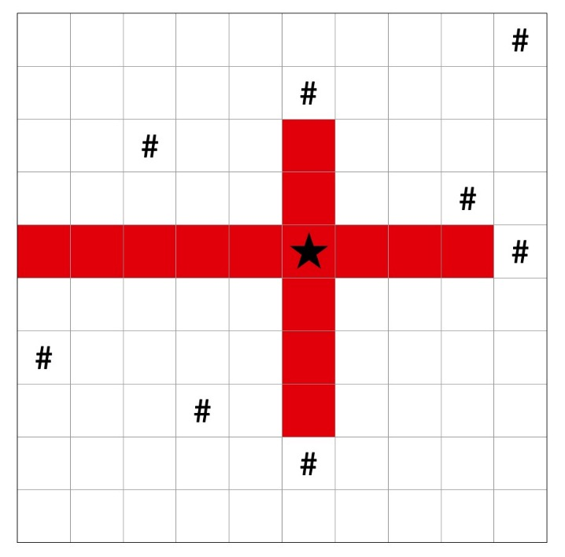

#### 题目描述

消消乐游戏可以看成一个n×m的方格图，每个方格上放置着可以消除的水果或是不可移动与消除的障碍物。玩家可以通过交换相邻的水果，使同一水果组成超过连续3个，便可将其消除。除此之外，还有一种道具叫做水果炸弹，在水果或空白格放置水果炸弹，便可从水果炸弹位置开始，同时向上下左右四个方向炸出，并消除沿途的水果，直至碰到障碍物为止。

例如下图所示：



图中`#`部分表示为障碍物，若在五角星处放置水果炸弹，其消除的水果范围在图中用红色方块表示，则在该位置放置水果炸弹可以消除的水果数量为 14 个。

给定游戏当前进行在一个n×m方格图上，每个格子用`.`表示水果，`#`表示障碍物，你拿到一个水果炸弹，请你计算如何放置水果炸弹，能使消除的水果数量最多，最多为多少个？

#### 输入

-   输入第一行，两个正整数n,m
-   接下来n行：每行m个字符，表示游戏方格的状态。

#### 输出

输出一个正整数，表示最多能消除的水果数量

#### 数据范围

-   对于30%的数据，1≤n,m≤10
-   对于100%的数据，1≤n,m≤100

___

#### 输入样例复制

```
4 4
##.#
...#
#...
####
```

#### 输出样例复制

```
5
```

#### 样例解释

将水果炸弹放置在 (2,3) 位置，此时最多能够消除 5 个水果